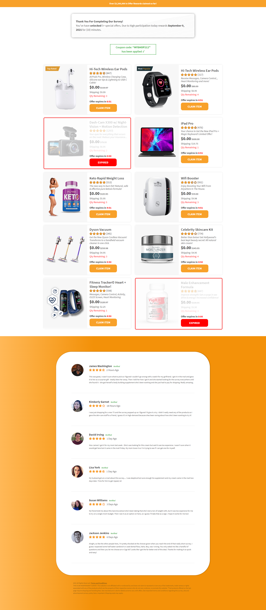

### `Bounty Hunter with raw jquery-` [Live Link](http://reward.iftikharrasha.com/).

<p align="center">
  <a href="http://reward.iftikharrasha.com/">
    
  </a>
</p>

<h1 align="center">Bounty Hunter</h1>

<p align="center">
  Design and prototyping using Adobe XD and built using HTML - CSS - bootstrap, JS - Jquery.
</p>



## 🚀 Installation

1.  Clone the repository and change directories

    ```shell
    git clone https://github.com/iftikharrasha/bounty-hunter-vanilla-jquery.git
    cd bounty-hunter-vanilla-jquery
    ```

2. Click index.html or Start the local server

    The site is now running at `http://127.0.0.1:5500/`!
    

3.  **Open the source code and start editing!**
 
 ## 🎨 Color Reference
| Color          | Hex                                                                |
| -------------- | ------------------------------------------------------------------ |
| White        |  `#FFFFFF` |
| Gray         |  `#CFCFCF` |
| Black        |  `#000000` |
| Green        |  `#4CAF50` |
| Primary      |  `#FFB857` |
| Accent       |  `#F8A12A` |
| Secondary    |  `#F39109` |
| Red          |  `#FF0000` |

